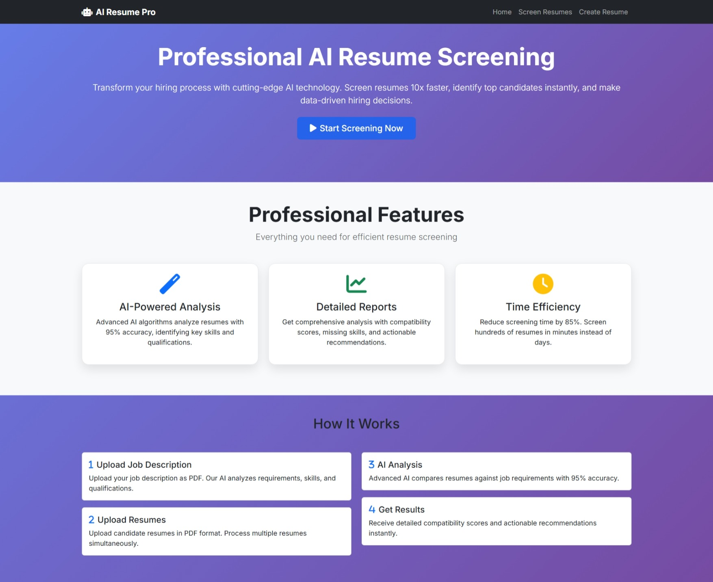
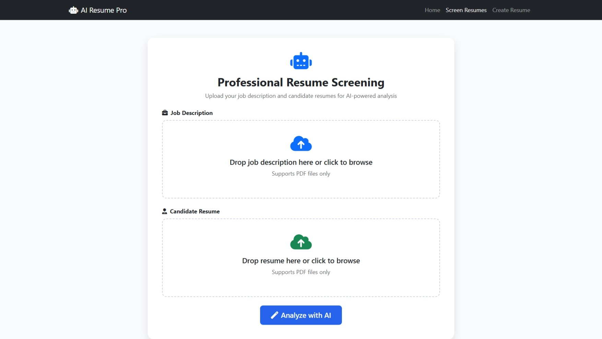
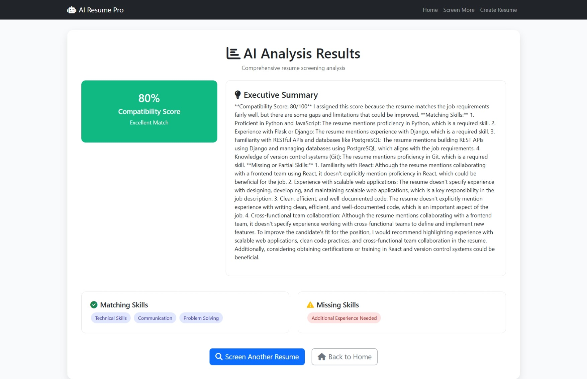
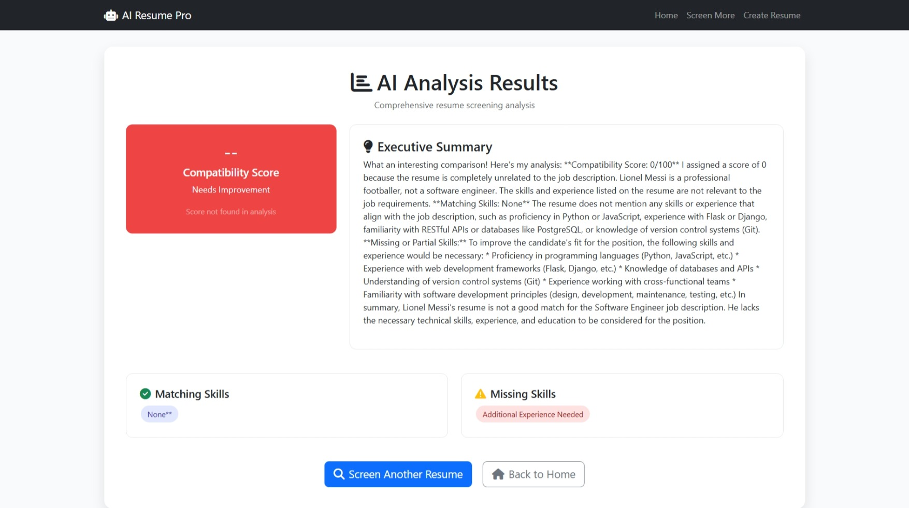

# AI-Powered Resume Screening System

This application automatically analyzes resumes against job descriptions to provide compatibility scores, highlight matching and missing skills, and suggest improvements for both job seekers and recruiters. The system uses advanced AI to provide detailed analysis and actionable insights.

## Features

- Upload job descriptions and resumes in PDF format
- AI-powered analysis using Groq's LLM API
- Dynamic compatibility scoring with visual indicators (Excellent, Good, Needs Improvement)
- Automatic extraction and display of matching skills
- Identification and highlighting of missing skills
- Personalized improvement suggestions
- Resume creation functionality
- Professional web interface with responsive design
- Robust error handling for various LLM response formats

## Screenshots

The application includes a `screenshots` folder with visual previews of the interface:


*Professional landing page with feature overview*


*Resume screening upload interface*


*Analysis results display with compatibility score and skill matching*


*Detailed analysis with improvement suggestions*

## Recent Improvements

### Dynamic Compatibility Score
- The system now dynamically extracts compatibility scores from AI analysis using multiple regex patterns
- Scores are categorized as "Excellent Match" (80-100%), "Good Match" (60-79%), or "Needs Improvement" (0-59%)
- Visual indicators change color based on score category (green, yellow, or red)
- Robust fallback mechanisms display appropriate messages when scores cannot be extracted

### Skill Matching
- Automatically extracts and displays matching skills from the resume
- Identifies missing skills required for the job
- Presents skills as interactive badges for better visualization

## Setup Instructions

### Prerequisites

- Python 3.8 or higher
- Groq API key
- Windows, macOS, or Linux operating system

### Installation

1. **Clone or download this repository**
   ```bash
   git clone <repository-url>
   cd resume_ screening_ai
   ```

2. **Create and activate virtual environment**
   ```bash
   # Windows
   python -m venv venv
   venv\Scripts\activate

   # macOS/Linux
   python3 -m venv venv
   source venv/bin/activate
   ```

3. **Install dependencies**
   ```bash
   pip install -r requirements.txt
   ```

4. **Set up environment variables**
   - Copy `.env` file and add your Groq API key
   - Example `.env` content:
   ```
   Groq_API_KEY=your_groq_api_key_here
   ```

### Running the Application

#### Method 1: Direct Python (Recommended)
```bash
python app.py
```

#### Method 2: Using Python module syntax
```bash
python -m app
```

#### Method 3: Using full path (if in different directory)
```bash
python "c:\Users\user\Desktop\resume_ screening_ai\app.py"
```

### Accessing the Application

Once running, open your web browser and navigate to:
- **Home page**: http://localhost:5000/
- **Resume screening**: http://localhost:5000/screen
- **Resume creation**: http://localhost:5000/create-resume

### Usage

1. **Resume Screening**: Upload a job description PDF and candidate resume PDF to get detailed analysis
2. **Resume Creation**: Fill in your details to generate a professional resume
3. **View Results**: Get compatibility scores, matching keywords, and improvement suggestions

### Troubleshooting

**File not found errors**: Ensure you're running from the correct directory
```bash
cd "c:\Users\user\Desktop\resume_ screening_ai"
python app.py
```

## Technical Implementation

### AI Analysis
- Uses Groq's LLM API to compare job descriptions and resumes
- Implements prompt engineering to ensure consistent response formats
- Extracts compatibility scores using multiple regex patterns for robustness

### Frontend
- Built with Flask and Jinja2 templating
- Dynamic content rendering based on AI analysis results
- Responsive design for various device sizes

### Error Handling
- Graceful fallbacks when AI responses don't match expected formats
- Debug information to trace pattern matching and extraction processes
- User-friendly error messages

**API errors**: 
- Verify your Groq API key is correctly set in the `.env` file
- Check your internet connection
- Ensure you haven't exceeded your API rate limits
- Look for error messages in the terminal output for specific API issues

**Port already in use**: The app runs on port 5000 by default. If occupied, Flask will use the next available port.

**Score extraction issues**: If compatibility scores aren't displaying correctly:
- Check the terminal for debug information about which regex patterns matched
- Verify the LLM is returning scores in one of the expected formats
- The application includes fallback mechanisms to handle various score formats

### Project Structure
resume_ screening_ai/
├── app.py                 # Main Flask application
├── match_engine.py        # AI processing and resume matching logic
├── templates/             # HTML templates
│   ├── index.html         # Home page template
│   ├── screen.html        # Upload interface template
│   └── result.html        # Analysis results template
├── static/                # CSS, JS, images
├── screenshots/           # Application screenshots
└── uploads/               # Temporary uploaded files

## Contributing

Contributions are welcome! Here's how you can help improve this project:

1. **Report bugs**: Open an issue describing the bug and steps to reproduce
2. **Suggest features**: Submit an issue with your feature request
3. **Submit pull requests**: Fork the repo, make changes, and submit a PR

### Development Guidelines
- Follow PEP 8 style guidelines for Python code
- Document new functions and classes
- Add appropriate error handling
- Test your changes thoroughly

## License

This project is licensed under the MIT License - see the LICENSE file for details.

### Complete Project Structure
resume_ screening_ai/
├── app.py                 # Main Flask application
├── match_engine.py        # AI processing and resume matching logic
├── templates/             # HTML templates
│   ├── index.html         # Home page template
│   ├── screen.html        # Upload interface template
│   └── result.html        # Analysis results template
├── static/                # CSS, JS, images
├── screenshots/           # Application screenshots
├── example_data/          # Sample PDF files
├── uploads/               # Temporary uploaded files
├── requirements.txt       # Python dependencies
├── .env                   # Environment variables
└── README.md              # This file

### Technologies Used

- **Backend**: Flask (Python)
- **AI Integration**: Groq API (llama3-8b-8192)
- **Frontend**: Bootstrap 5, HTML5, CSS3, JavaScript
- **PDF Processing**: PyMuPDF
- **Environment**: Python 3.8+